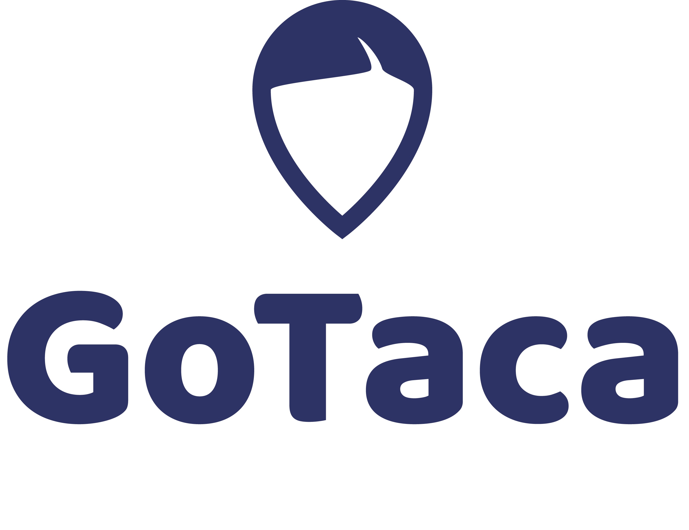
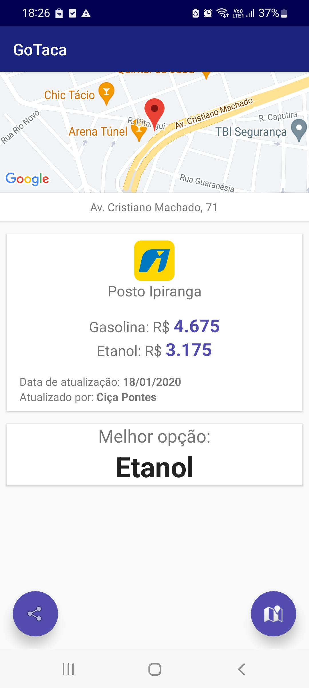

# GoTaca

    

#### Description:

The GoTaca is a Java Android application developed to help drivers to find the best solution to full fill their cars. In several countries, maintein a car is pretty expensive. Therefore, it represents an important part of the cost of living.

GoTaca is an interest tool based on information sharing between users promoted by gamification and the feeling of helping themselves.

Through the application, it's possible to list all gas stations in the main avenues and streets of the city, filtering it by fuel type and price using resources as Map and Recycler View. To go to the gas station, it's possible to get direction by map applications. When users get to the Gas Station, it's possible to share the photo of the price. The application will send the date, hour and location as metadata.

  

    
  

  

    
  

#### Excited to see the code?

## Thank you! For more information, just call me!
